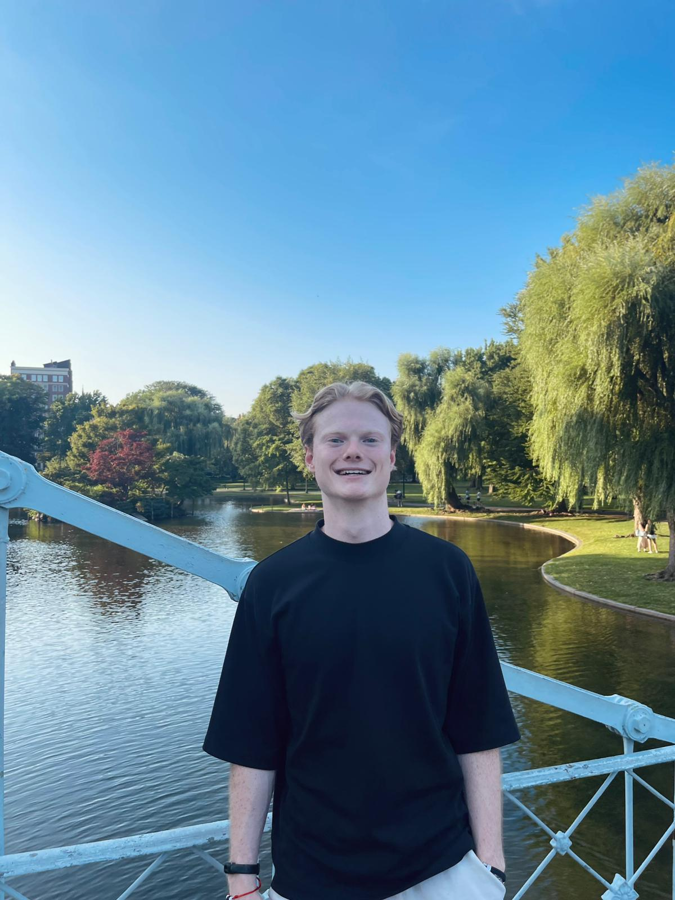

# Welcome!

Hi, I’m **Lars ten Hacken**. Welcome to my personal website.

{:style="width:200px;border-radius:50%;"}

## Profile
I’m a MSc student in Applied Physics at TU/e, pursuing the track Fluids, Bio- and Softmatter. I am passionate about **fluid dynamics**, **soft matter physics** and **computational physics**. Currently I am located in the United States for a six month appointment as visiting researcher at the Theoretical and Applied Fluid Dynamics Laboratory (taflab.berkeley.edy) of the University of California, Berkeley, working on a project in ocean wave reconstruction and prediction. In November, I return to the Netherlands to start my graduation project in collaboration with Tsinghua University, where I will conduct reasearch from February to May, in icing under complex conditions.

Besides my academic carreer, I have been active in a multitude of organisations to broaden my horizon and develop myself both personally and professionaly. From these experiences I would like to highlight: 

Learn more [about my research](about) or check my [resume](projects).

