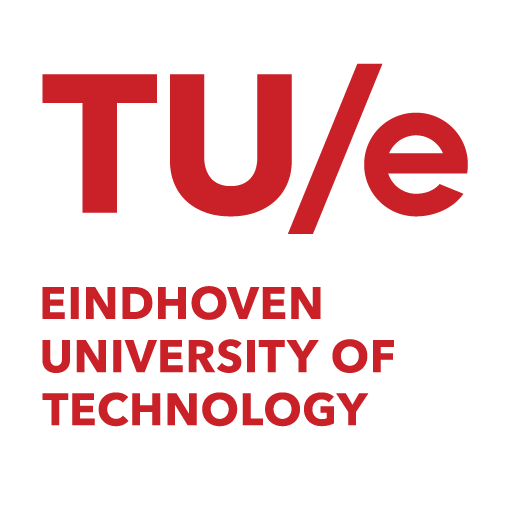
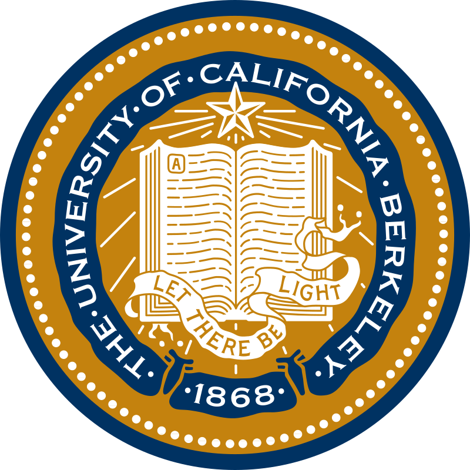

# Welcome!

Hi, I’m **Lars ten Hacken**. Welcome to my website!

  
  

    
    
    

## Profile
I’m a MSc student in Applied Physics at Eindhoven University of Technology, pursuing the track Fluids, Bio- and Softmatter. I am passionate about **fluid dynamics**, **soft matter physics** and **computational physics**. Currently I am located in the United States for a six month appointment as visiting researcher at the Theoretical and Applied Fluid Dynamics Laboratory ([TAFLab](https://taflab.berkeley.edu/)) of the University of California, Berkeley, working on a project in ocean wave reconstruction and prediction. In November, I return to the Netherlands to start my graduation project in collaboration with Tsinghua University, where I will conduct reasearch from February to May, on icing under complex conditions.

## Background 
During my academic carreer I have developed proficiency in a multitude of programming languages and frameworks aimed at scientific computing, engineering and artificial intelligence. I consider myself well experienced in Python, having done projects involving object-oriented programming and writing modules. Besides Python, I have worked on projects involving control and simulation using Matlab and Simulink, used Wolfram Mathematica for symbolic math and scripting, and have experience working with Git, Linux, C and openACC on fluid simulations and HPC applications. Two projects I'd like to highlight are:

- Ocean wave reconstruction and prediction using the Higher Order Spectral (HOS) method and Ensemble Kalman Filtering (EnKF). Supported bij a €2.500 grant.

- High Performance Computing (HPC) implementation of the Lattice Boltmann method in C using OpenACC

Besides my academic carreer, I have been active in a multitude of organisations to broaden my horizon and develop myself both personally and professionaly. From these experiences I would like to highlight: 

- A year as full time president of Junior Enterprises The Netherlands ([UniPartners Nederland](https://www.unipartners.nl/nederland/)), where I was ultimately responsible for the national board and twelve local offices invloving 300+ students/consultants, € 800k turnover and 250+ projects. 

- My role as trainer and speaker at [De AI Workshop](https://www.deaiworkshop.nl/), where I lead hands-on workshops on artificial intelligence and it's implementation for a wide range of audiences. 

- Selected as delegate for the [Netherlands Asia Honors Summer School](https://www.nahss.nl/en/), a prestigious programme in Hong Kong and Ho Chi Minh City for the 70 best applicants across Dutch universities. The curriculum focussed on contemporary relations between East Asia and the West.

- Treasurer of [Business Core Eindhoven](https://www.business-core.nl/), managing a € 60k budget alongside other organisational tasks for Eindhoven's biggest student symposium. 

Check my [resume](assets/Lars_ten_Hacken_CV.pdf).

Other Links: 
[University Paper (Cursor) Article](https://www.cursor.tue.nl/en/campus/2025/juli/week-1/and-how-are-things-in-berkeley)