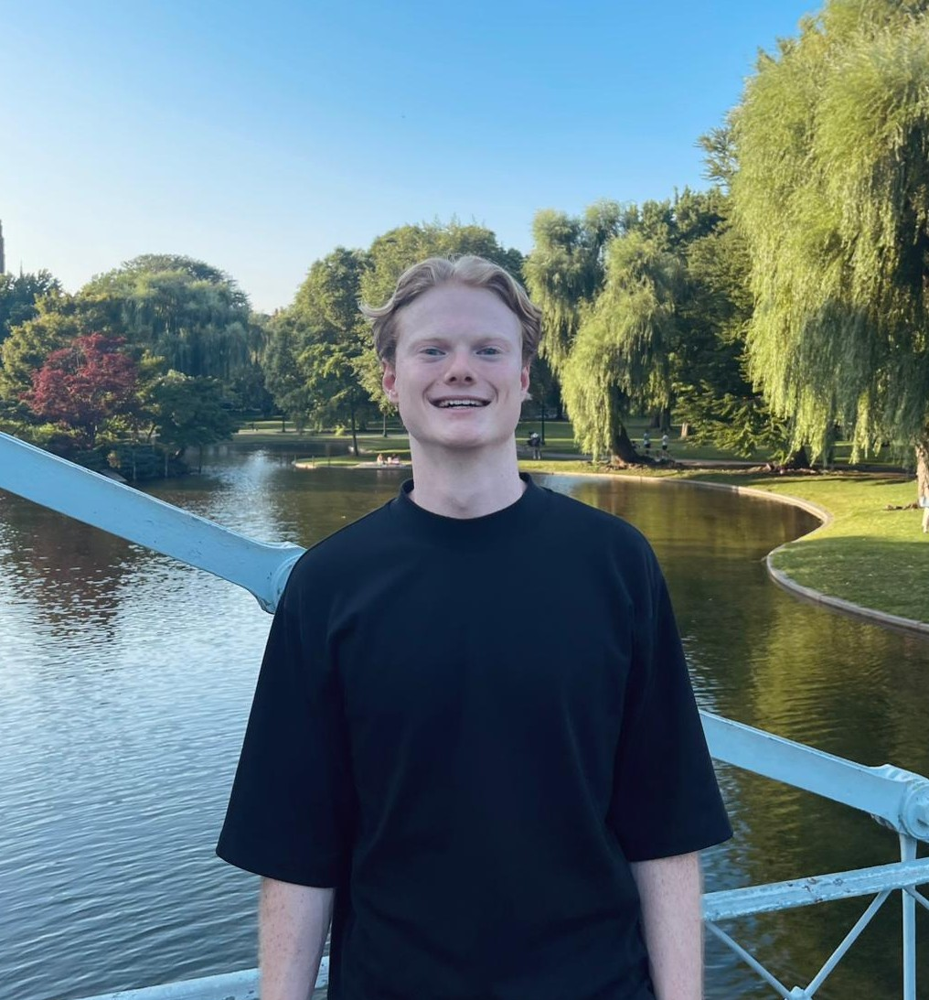

# Welcome!

Hi, I’m **Lars ten Hacken**. Welcome to my personal website!

{:style="width:300px;"}      ``border-radius:50%;"}``

## Profile
I’m a MSc student in Applied Physics at Eindhoven University of Technology, pursuing the track Fluids, Bio- and Softmatter. I am passionate about **fluid dynamics**, **soft matter physics** and **computational physics**. Currently I am located in the United States for a six month appointment as visiting researcher at the Theoretical and Applied Fluid Dynamics Laboratory (taflab.berkeley.edu) of the University of California, Berkeley, working on a project in ocean wave reconstruction and prediction. In November, I return to the Netherlands to start my graduation project in collaboration with Tsinghua University, where I will conduct reasearch from February to May, in icing under complex conditions. My main interests are computational fluid dynamics, soft matter and active matter physics. 

During my academic carreer I have developed proficiency in a multitude of programming languages and frameworks aimed at scientific computing, engineering and artificial intelligence. I consider myself well experienced in Python, having done projects involving object-oriented programming and writing modules. Besides Python, I have worked on projects in Matlab involving control and simulation and have Mathematica 

Two projects I'd like to highlight are:

- Ocean wave reconstruction and prediction using the Higher Order Spectral (HOS) method and Ensemble Kalman Filtering (EnKF):

- High Performance Computing (HPC) implementation of the Lattice Boltmann method in C using OpenACC:

Besides my academic carreer, I have been active in a multitude of organisations to broaden my horizon and develop myself both personally and professionaly. From these experiences I would like to highlight: 

- President JE Netherlands

- NAHSS

- De AI Workshop 

Learn more [about my research](projects) or check my [resume](assets/Lars_ten_Hacken_CV.pdf).

